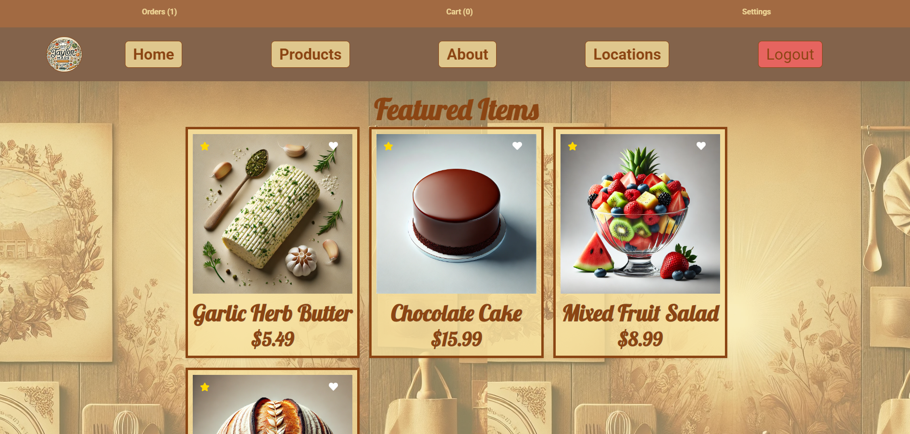

# TaylorMade

TaylorMade is a full-stack e-commerce application designed for browsing and purchasing food products with features like user authentication, shopping cart management, and order processing.

## Table of Contents

- [Features](#features)
- [Technologies](#technologies)
- [Frontend Components](#frontend-components)
- [Backend Functionality](#backend-functionality)
- [API Documentation](#api-documentation)
- [Installation](#installation)
- [Live Demo](#live-demo)
- [Contributing](#contributing)

---

## Features

**User Authentication (Login/Register)**  
 **Product Browsing and Filtering**  
 **Shopping Cart Management**  
 **Order Processing**  
 **Admin Dashboard**  
 **Responsive Design**

---

## Technologies

### Frontend

- **React.js**
- **React Router**
- **Context API**
- **CSS3**

### Backend

- **Node.js**
- **Express.js**
- **MongoDB**
- **JWT Authentication**

---

## Frontend Components

### Home

The `Home` component is the **main landing page**, displaying featured products, user orders, cart items, and favorite items.

- **Props:**

  - `items` (Array) - List of products.
  - `orders` (Array) - List of user orders.
  - `fetchItems` (Function) - Fetches products.
  - `fetchOrders` (Function) - Fetches user orders.
  - `savedItems` (Array) - List of saved items.

- **Methods:**
  - `handleShowPreview` - Opens preview modal.
  - `handleShowBuyModal` - Opens buy modal.
  - `handleAddToCart` - Adds product to cart.
  - `handlePurchase` - Handles purchase.
  - `closeModal` - Closes modal.

---

### Products

The `Products` component displays a **list of products** based on categories and allows users to preview, purchase, and favorite items.

- **Props:**

  - `addToCart` (Function) - Adds item to cart.
  - `likeItem` (Function) - Likes a product.
  - `openPreview` (Function) - Opens preview modal.
  - `openBuyModal` (Function) - Opens buy modal.

- **Methods:**
  - `handleShowPreview`
  - `handleShowBuyModal`
  - `handleAddToCart`
  - `handlePurchase`
  - `toggleFavorite`
  - `renderProductCard`
  - `renderCategory`

---

### Modals

#### PreviewOverlay

Allows users to **view product details**, change quantity, add to cart, and buy.

- **Props:**
  - `isOpen`
  - `onClose`
  - `product`
  - `quantity`
  - `isLiked`
  - `onQuantityChange`
  - `onAddToCart`
  - `onBuyNow`
  - `onFavorite`

#### BuyModal

Used for purchasing products by entering details.

- **Props:**
  - `isOpen`
  - `onClose`
  - `product`
  - `quantity`
  - `onPurchase`

---

### Card

Displays **product details and actions**.

- **Props:**
  - `product`
  - `isFeatured`
  - `onAddToCart`
  - `onBuyNow`
  - `onFavorite`
  - `onClick`

---

## Backend Functionality

The **backend** of TaylorMade is built with **Node.js & Express** and provides APIs for authentication, product management, and orders.

### Key Features

🔹 **User Authentication** – JWT-based login & registration.  
🔹 **Product Management** – CRUD operations on products.  
🔹 **Order Processing** – Manage orders efficiently.  
🔹 **Cart Management** – Add, update, save, and remove cart items.

---

## API Documentation

**Base URL:** `http://localhost:5000/api`

### Authentication Routes

- **POST** `/api/auth/register` – `{ name, email, password }`
- **POST** `/api/auth/login` – `{ email, password }`

### Product Management

- **GET** `/api/products` – Fetch all products.
- **POST** `/api/products` – `{ name, description, price, categories, isFeatured }`
- **PUT** `/api/products/:id`
- **DELETE** `/api/products/:id`

### Order Processing

- **GET** `/api/orders` – Fetch user orders.
- **POST** `/api/orders` – `{ productId, quantity, address }`

### Cart Management

- **GET** `/api/cart`
- **POST** `/api/cart` – `{ productId, quantity }`
- **PUT** `/api/cart/:id`
- **DELETE** `/api/cart/:id`

## Video Presentation

[Live Presentation](https://www.tella.tv/video/cm9nrim2o000r0bl75i0e4f54/view)

---

## Installation

1. Clone repository:
   git clone https://github.com/GoReala23/TaylorMade.git

2. Install dependencies:
   Backend
   cd backend
   npm install

Frontend
cd frontend
npm install

3. Environment Setup:
   Create `.env` in backend directory:

4. Start Application:
   Backend
   npm run dev

Frontend
npm start

## Screenshots

## Live Demo

[View Live Demo](https://goreala23.github.io/TaylorMade)

## Contributing

1. Fork repository
2. Create feature branch
3. Commit changes
4. Push to branch
5. Create Pull Request
